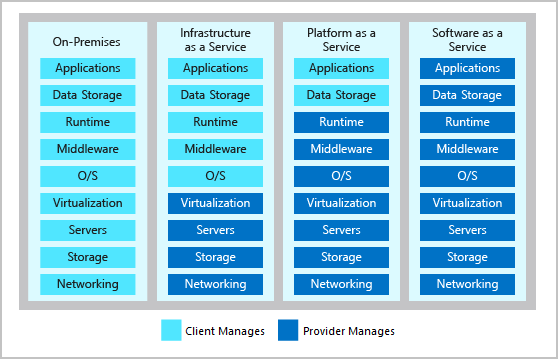

# Intro to Azure Fundamentals

## Introduction

Benefícios da núvem:

**Alta disponibilidade:** dependendo do contrato de nível de serviço que você escolher, seus aplicativos baseados em nuvem poderão oferecer uma experiência de usuário contínua, sem tempo de inatividade aparente, mesmo quando as coisas derem errado.

**Escalabilidade:** os aplicativos na nuvem podem ser redimensionados de duas maneiras:
  - **Verticalmente:** a capacidade computacional pode ser aumentada pela adição de RAM ou CPUs a uma máquina virtual.
  - **Horizontalmente:** a capacidade computacional pode ser aumentada pela adição de instâncias de um recurso, como a inclusão de máquinas virtuais à configuração.

**Elasticidade:** aplicativos baseados em nuvem podem ser configurados para fazer uso do dimensionamento automático, de modo que esses aplicativos sempre tenham os recursos de que precisam.

**Agilidade:** os recursos baseados em nuvem podem ser implantados e configurados rapidamente conforme as alterações dos requisitos do aplicativo.

**Distribuição geográfica:** os aplicativos e os dados podem ser implantados em data centers regionais em todo o mundo, de modo que os clientes sempre tenham o melhor desempenho em cada região.

**Recuperação de desastre:** ao aproveitar os serviços de backup baseados em nuvem, a replicação de dados e a distribuição geográfica, você pode implantar os aplicativos com a confiança de saber que seus dados estão seguros caso ocorra um desastre.

## Responsabilidades compartilhadas

## Serviços da Azure

# Discutir conceitos fundamentais do Azure

Há dois tipos diferentes de despesas que você deve considerar:

- **CapEx (despesas de capital)** são os gastos antecipados de dinheiro com a infraestrutura física e a posterior dedução dessas despesas antecipadas ao longo do tempo. O custo inicial de CapEx tem um valor que é reduzido ao longo do tempo.

- **OpEx (despesas operacionais)** são gastos atuais com serviços ou produtos, que são cobrados no ato. Você pode deduzir essas despesas no mesmo ano em que gasta. Não há nenhum custo antecipado, pois você paga por um serviço ou produto conforme o usa.

## Assinaturas do Azure

Pode se usar de dois tipos de limites de assinatura:
- Limite de cobrança
- Limite de controle de acesso

Para o caso de muitas assinaturas podemos utilizar os **Grupos de gerenciamento do Azure**. Podemos assim aplicar políticas a um grupo de gerenciamento para limitar as regiões disponíveis para a criação de VMs, entre outras políticas no aspecto mais geral. Além dos Grupos podemos criar uma hierarquia de grupos de gerenciamento, a fim de organizar melhor o controle macro.

Outro cenário é fornecer acesso de usuário a várias assinaturas. Ao mover várias assinaturas nesse grupo de gerenciamento, você poderá criar uma atribuição de RBAC (controle de acesso baseado em função) no grupo de gerenciamento, que herdará esse acesso a todas as assinaturas

## Recursos do Azure e Azure Resource Manager

- Recurso
- Grupo de recursos

Grupos de recursos podem ser utilizados para ambientes de não produção, em que é necessário utilizar algum experimento e depois remover o grupo de recursos, assim todos os recursos são removidos automaticamente.

Utilizando o Resource Manager é possível:
- Gerenciar a infraestrutura, já que é um arquivo JSON que define o que é implantado na Azure.
- Definir as dependências entre os recursos e garantir a ordem de implantação
- Garantir controle de acesso por RBAC(controle de acesso baseado em função)
- Esclarecer a cobrança da organização exibindo os custos por grupos

## Disponibilidade de Zonas

- Disponibilidade
  - Serviços em zonas: zona específica
  - Serviços com redundância de zona: replica automaticamente entre as zonas

**Par de regiões** garante a replicação de dados em zonas próximas geograficamente

# Migração

Estrutura de migração
- Avaliar
- Migrar
- Otimizar
- Monitorar

## Avaliar

- Descoberta e avaliação
  - Identificar todos os servidores, aplicativos e serviços que estão no escopo da migração
  - Produzir um mapa de dependências e um inventário completo do escopo

Para cada aplicativo, há várias opções de migração:
- Hospedar novamente: recriar a infra
- Refatorar: mover serviços em execução para o formato de PaaS, ou IaaS em caso de containização
- Recriar a arquitetura: 
- Recriar
- Substituir: substituir por apps de terceiros que resolvem já problemas recorrentes de forma mais eficiênte

Outras necessidades para a migração
- Envolver os stakeholders: proprietários e superusuários
- Estimar a economia de custos

### Ferramentas para ajudar no desenvolvimento da migraçaõ

## Migrar

- Implantar destinos de infraestrutura de nuvem
- Migrar cargas de trabalho: começar com uma migração pequena

## Otimizar

- Analisar os custos de execução
- Examinar oportunidades de melhorar

## Monitorar

Configurar alertas em uma variedade de fontes de dados:
- Valores de métricas específicos, tais como o uso da CPU
- Texto específico em arquivos de log
- Métricas de integridade
- Uma métrica de dimensionamento automático

O **Azure Sentinel** fornece funcionalidades de SIEM (gerenciamento de eventos e informações de segurança) juntamento com inteligência artifial para garantir segurança.

## Migração para Azure

Ferramenta de avaliação descobre quais são os serviços que devem ser migrados, junto com seus dados de utilização de memória, CPU, IOPS de disco, taxa de transferência e rede.

- Pós migração
  - Restringir os serviços não usados usando grupos de segurança
  - Adicionar agendamento de backup
  - replicar máquinas
  - instalar Azure Disk Encryption para proteger os discos contra roubo de dados

## Migração de banco de dados do Azure

- Migração Off-line: desligamento do serviço
- Migração On-line: sincronização contínua

# Serviço de Banco de Dados e análise do Azure

## Azure Cosmos DB

É um serviço de multimodelo de banco de dados dstribuído globalmente.

No nível mais baixo, o Azure Cosmos DB armazena dados no formato ARS (atom-record-sequence). Os dados são então abstraídos e projetados como uma API, que você especifica ao criar o seu banco de dados. Suas opções incluem SQL, MongoDB, Cassandra, Tables e Gremlin. Assim os desenvolvedores utilizam as APIs que já estão confortáveis para gerenciar os dados.

