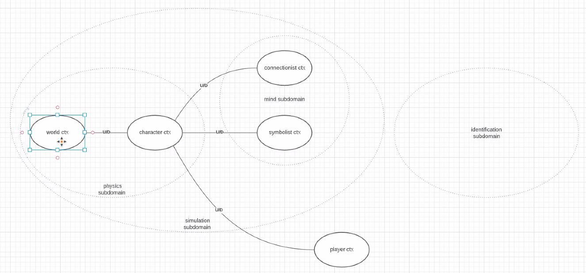

# Tech Talk: DDD Tático

Data: 13/01/2021

Objetivo: trazer a tona a essênsia de fazer um design para um domínio específico

Essência do DDD

- Construir um entendimento entre o negócio e o código
  - Construir um modelo de domínio que seja rico, ou seja, ele descreve bem o domínio que está trabalhando
  - No código fonte separar o que são as necessidades do negócio do que são implementações específicas ou técnicas
    - Código fonte do negócio (código útil)
    - Código fonte de bibliotecas externals (código acidental)

## Exemplo ACME Games

Plataforma de jogos de RPG baseados em sistema de turnos e proverá uma implementação de sistema de jogos padrão. Formato da plataforma Whitelabel.

Para desenhar esse projeto a primeira coisa foi criar um diagrama de contexto com cada domínio do problema separado.

### Diagrama de contexto

