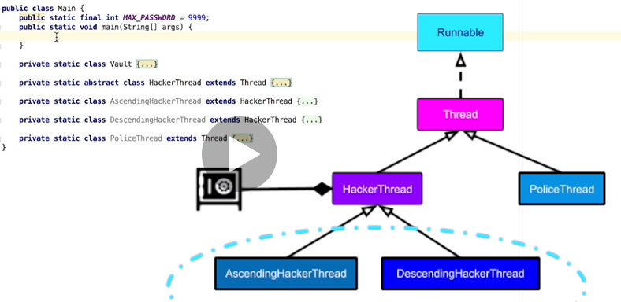
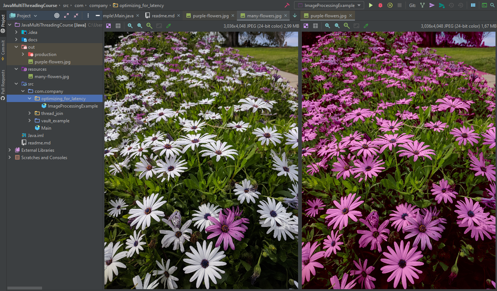
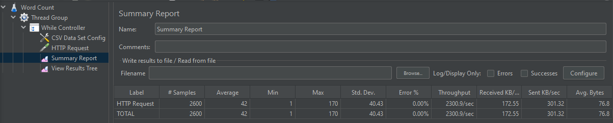

# Java MultiThreading Concurrency and Optimize Performance

Notas relacionadas ao curso de processamento concorrente apresentado por Michael Pogrebinsky.

[Link para o curso](https://www.udemy.com/course/java-multithreading-concurrency-performance-optimization)

# Vault Example

Exemplo demonstrando múltiplas threads trabalhando em concorrência



# Thread Termination

Why?

- Threads consume resources
- Thread takes too long
- Thread está comportando de forma não esperada
- Quando queremos matar a aplicação, todas as threads devem ser interrompidas

Daemon Threads, threads em background que não importa se estão sendo executadas mesmo se a thread
principal foi interrompida

# Thread Joining

Threads rodam totalmente independentes entre elas.

- Thread coordination
  - Naive Solution: ficar esperando que a thread dependente espere a outra thread terminar
  - Thread.Join Solution: a thread principal é sincronizada com a thread dependente    
  
# Performance & Optimizing for latency

Todo tipo de otimização deve ser planejada levando em consideração o caso a ser otimizado.

- Latêcia (latency)
- Velocidade (throughput)
  - Quantidade de tarefas finalizadas

Número de trheads pode ser calculado para ser próximo do número de cores do computador,
um código é mais otimizado quando **todos os cores** da máquina estão sendo **executados sem descanso**.

Custo de paralelizar

- Quebrar as tarefas em threads
- Criação das threads e passagem das tarefas para as threads
- Tempo entre thread.start() para ser agendado para executar
- Tempo até todas as threads finalizarem e enviarem os sinais de completude
- Tempo para agregar as threads
- Tempo de combinar as threads em um único resultado

- Tarefas paralelizáveis
- Tarefas que não podem ser quebradas
- Tarefas que podem ser parcialmente quebradas

## Image processing

Nesse caso o processamento da imagem foi dividido verticalmente.

Podemos reparar que quanto mais threads mais rápido o processamento é finalizado, porém 
depois que o número de cores lógicos é alcançado o desempenho não tem nenhuma melhora.



## Thread Pooling

Uma forma de otimizar o código é criar previamente um Pool de Threads e associar cada tarefa as thread
já criadas, dessa forma não precisamos gastar tempo criando threads para cada operação.



# Memory Management
 
- Stack region
  - Memória onde os métodos são chamados e as variáveis são armazenadas
    - Variáveis locais
    - Referências locias
  - São espaços de memória que não são compartilhados entre as threads
- Heap memory
  - Objetos criados pelo operador **new** são armazenados na heap
    - Static
    - Instance
  - Gerenciada pelo GC (Garbage Collector)
  - Podem ser compartilhados entre as threads

````java
public class Example {
    private Map<Integer, String>  idToNameMap; // allocated on heap
    
    private static long numberOfInstances = 0; // allocated on heap
    
    public Example() {
        this.idToNameMap = new HashMap<>();
        numberOfInstances++;
    }
    
    public List<String> getAllNames() {
        int count = idToNameMap.size(); // count: allocated on stack
        List<String> allNames = new ArrayList<>(); // allNames: allocated on stack
        
        allNames.addAll(idToNameMap.values()); // idToNameMap.values(): references an object on heap
        
        return allNames;
   }
}  
````

# Critical Section & Synchronization

Poblema quando executamos operações que não são atômicas, nesse caso 
podemos acabar com um resultado diferente do esperado, por culpa da concorrência aos dados entre as threads.

Soluções:

Sincronização é sempre executada a nível de objeto não de classe, 
assim threads que executam métodos de diferentes objetos não são bloqueadas.

- Synchronized
  - **Monitor:** métodos que serão thread safe, apenas um thread pode executar um método de código por vez
  - **Lock:**  apenas uma thread pode executar um pedaço de código por vez
  
## Atomic operations

- Getters and Setters
- Atribuições para valores primitivos
  - exceto **long** values, podemos declarar assim então a palavra reservada **volatile**, para garantir a atomicidade
- java.util.concurrent.atomic
  - Outras estruturas que o Java disponibiliza para garantir atomicidade


## Locking strategies

- Coarse-Grained Locking
  - um único lock (objeto) que gerencia a entrada de thread em código crítico
  - não permite o código ser melhor otimizado já que mesmo regiões que não são dependentes estão
    sendo sincronizadas pelo mesmo lock
- Fine-Grained Locking
  - todos os blocos são sincronizados por objetos diferentes
  - essa estratégia pode levar a um Deadlock
    - quando uma thread bloqueia o acesso a um código de outra thread e vice versa
    - evitar circular dependencia entre os locks do código sincronizado

# Advanced Locking

## ReentrantLock

ReentrantLock: explicitamente utilizar um objeto que implementa lock para garantir acesso.

- TryLock()
  - nunca trava a thread, utilizado em sistemas que precisam de responsividade

ReentrantReadWriteLock
- Os principais problemas com multi threading estão onde vários 
  controladores consomem um resource e pelo menos um modifica
- Em casos onde temos mais leitura que escrita em um sistema, 
  podemos utilizar ReentrantReadWrite, assim, em caso de consultas as threads não serão bloqueadas do recurso
  
## Semaphore

Pode ser utilizado para restringir o número de usuário a um recurso.

- Semáforo não tem noção do significado de possuir um thread (owner thread)
- Várias threads podem adquirir uma permissão (permit)
- É uma opção principalmente para o caso de Produtor Consumidor
  - Mesmo quando o Consumidor é mais rápido que o Produtor, o Consumidor passará a maior parte do tempo no modo idle
  - Podemos utilizar também uma Fila para garantir o consumo dos valores produzidos
  
## Inter Thread Communication

Podemos utilizar uma condição para saber se a thread está no momento de mudar de estado ou não.

Exemplo: Producer Consumer
- User Interface Thread
- Busca no banco de dados Thread
  - Demora para ser concluída

## wait(), notify(), notifyAll()

A própria classe Object tem implementados esses métodos. 

Uma coisa que precisamos prestar atenção é quando os Produtores são mais rápidos que os consumidores, 
isso pode levar ao crash inesperado do sistema em caso da memória consumida ultrapassar o limite de memória disponível,
para resolver esse problema podemos implementar uma técnica de back pressure onde limitamos o número de 
elementos produzidos pelos produtores e acordamos as threads consumidoras 
para já começar a resolver os elementos na fila.

# Lock-free Algorithms, Data-Structures & Techniques

Locks podem trazer vários problemas para a aplicação como:
   
- Deadlocks
- Slow Critical Sections
- Priority Inversion
  - Duas threads compartilhando um lock
- Thread not Releasing a lock
- Perfomance
  - Utilizar multiplas threads consome mais recursos que não utilizar
  
Lock Free Techniques
- Utilizar operações que são atômicas de preferência
- Utilizar operações mais próximas do hardware para garantir a atomicidade dessas instruções

AtomicX biblioteca Java para a utilização de operações atômicas.


