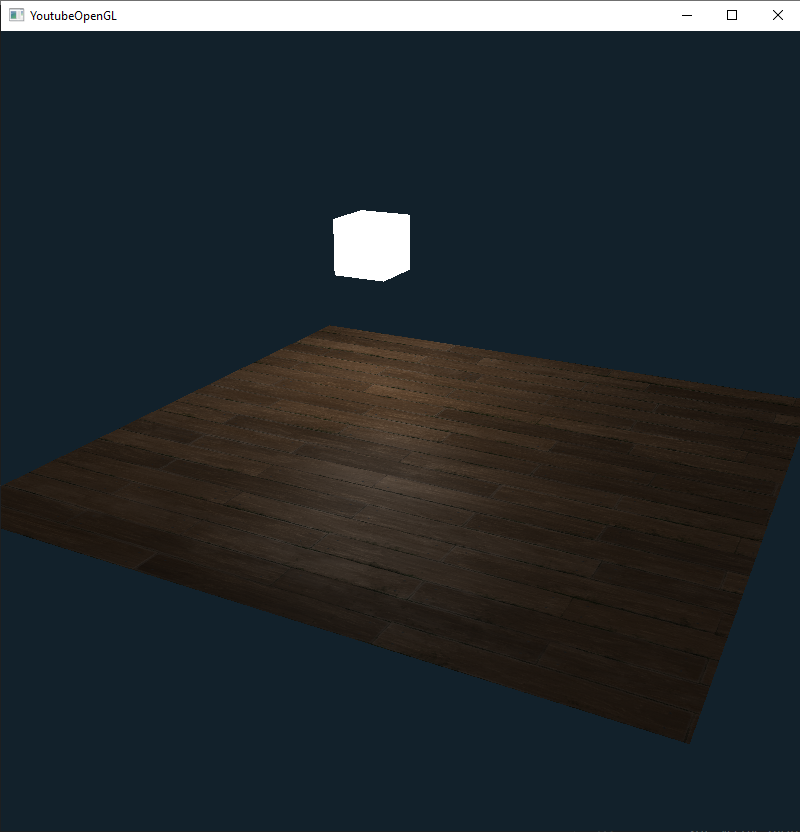

# Extração da lógica de criaçaõ de meshes dentro da cena

**Classe de implementação:** Mesh.h

Modo de utilização

```cpp
	// Criação do shader program
	ShaderProgram shaderProgram("light_shader.vert", "point_light.frag");

    // Criação das texturas
	TextureBuilder textures[]
	{
		TextureBuilder("planks.png", "diffuse", 0).Format(GL_RGBA, GL_UNSIGNED_BYTE).Build(),
		TextureBuilder("planksSpec.png", "specular", 1).Format(GL_RED, GL_UNSIGNED_BYTE).Build()
	};

    // Conversão de vetores fixos para vector que serão utilizados na classe Mesh
	std::vector<Vertex> verts(vertices, vertices + sizeof(vertices) / sizeof(Vertex));
	std::vector<GLuint> ind(indices, indices + sizeof(indices) / sizeof(GLuint));
	std::vector<TextureBuilder> tex(textures, textures + sizeof(textures) / sizeof(TextureBuilder));

    // Criação do mesh
	Mesh floor(verts, ind, tex);

    ...

    // Scene Loop
    while (!glfwWindowShouldClose(window))
	{
		glClearColor(0.07F, 0.13F, 0.17F, 1.0F);

		glClear(GL_COLOR_BUFFER_BIT | GL_DEPTH_BUFFER_BIT);

		movement.Inputs(window, camera);
		camera.SetupPerspectiveView(45.0f, 0.1f, 100.0f);

        // Desenho do mesh
		floor.Draw(shaderProgram, camera);

		glfwSwapBuffers(window);
		glfwPollEvents();
	}

```

