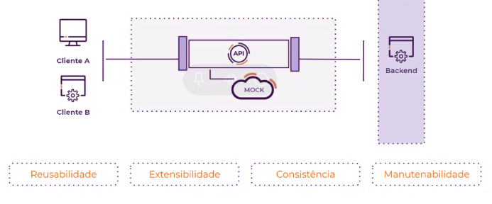
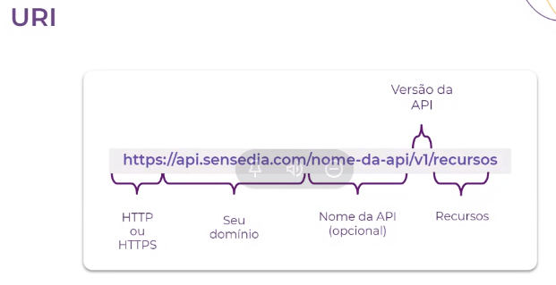
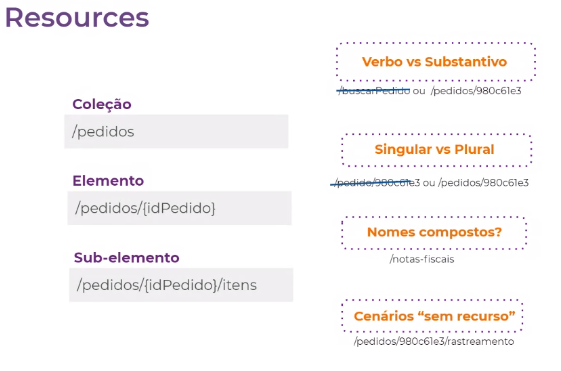
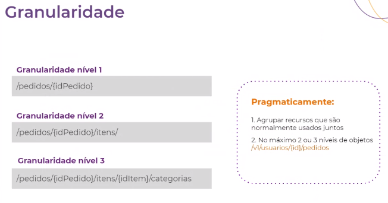
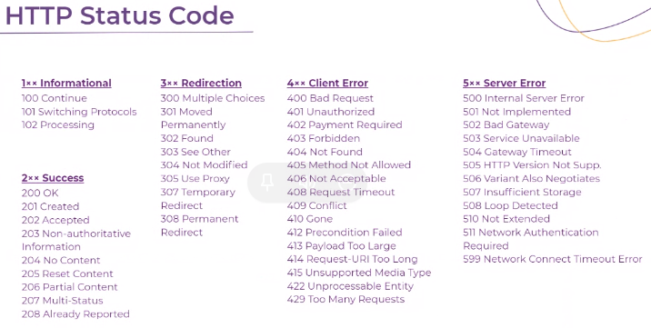
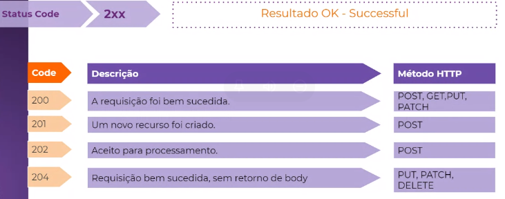
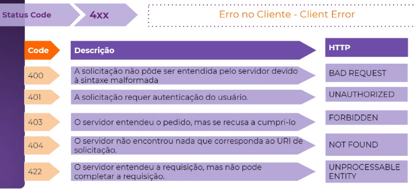
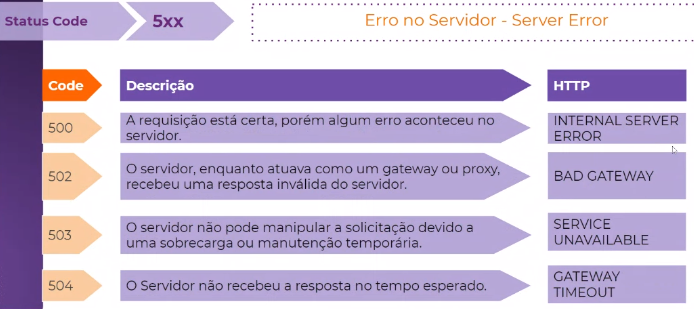

# Treinamento de REST

Por que APIs?

- Provêm uma interface comum
- Facilidade de implementação

Modelagem comum

- Banco de dados
- Serviços
- APIs

API First

## Padronização REST

- Representational State Transfer
- Estilo arquitetural que utiliza o HTTP visando maior interoperabilidade entre aplicações distribuídas
- Client-Server
  - O client é responsável pela parte do frontend e não se preocupa com a forma que está implementado o backend, mesma coisa o contrário
  - Por exemplo, não é necessário saber o nome do método para acessar uma lista de produtos, isso é definido por um endpoint que será publicado e disponibilizado publicamente, assim o cliente só precisa saber o endpoint e não como está implemetando
- Stateless
- Cacheable
- Layered System
  - As responsabilidades podem ser distribuídas em aplicações (camadas, servers)
- Interface/Uniform
- Contract

> Uma API RESTFul é uma api que implementa todos os conceitos do REST

### Por que REST?

- Web já construída em cima do HTTP
- Fácil de entender
- Variedade de implementações

## Design de APIs

### Domínio & URI

> Colocar o nome da api no caminho ajuda muito na rastreabilidade da aplicação, principalmente por causa da plataforma da Sensedia

Ambientes (Environments)
- Production: https://api.mycompany.com/
- Sandbox: https://api-sandbox.mycompany.com/
- Homologation: https://api.mycompany.com/homolog

### Resource

### Granularidade

### Verbos HTTP

Utilizar os verbos de acordo com a ação necessária

- GET
  - Método responsável pela consulta
- POST
  - Método responsável por criar informações
- PUT
  - Método responsável por atualizar informações
  - Esse método é indepotente, ou seja, 
    todas as informações a partir daquele momento serão definidas pela mensagem do PUT
  - Pode criar se não existe
- Patch
  - Método responsável por atualizar informações de forma parcial
- DELETE
  - Método responsável por remover informações

### HTTP Status Code

> Evitar trabalhar apenas com Internal Server Error, já que na hora de avaliar é bem mais complicado.

### Versionamento

> É necessário criar um versionamento quando o contrato com o cliente é quebrado de alguma forma quando o servidor irá adicionar algum recurso.

